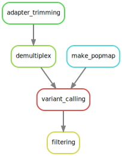

# README.md

This is a [Snakemake](https://snakemake.readthedocs.io/en/stable/) pipeline implementing the [Stacks](https://catchenlab.life.illinois.edu/stacks/manual/) *denovo_map.pl* and *refmap.pl* workflows for paired-end RAD-Sequencing data. It outputs a [VCF file](https://en.wikipedia.org/wiki/Variant_Call_Format) at the end of the SNP calling.

## Dependencies

This pipeline was built with 

- **snakemake** v 8.1.0
- **stacks** v2.67
- **fastqc** v0.12.1 
- **cutadapt** v4.4
- **vcftools** v0.1.5

for the reference-based version, the following dependencies are also required:

- **bwa** v0.7.18
- **samtools** v1.9

## Quick start

To run the pipeline on the example data (3 samples, denovo).

1.  Download this repository.
3.  From inside the repository, after checking dependencies:
   ```sh
  snakemake --cores all filtered.recode.vcf
   ```
Outputs:

- **filtered.recode.vcf** The VCF file at the end of the pipeline.
- **filtered.imiss** A file containing the proportion of missing data er individual. this file can be used to choose which individuals to exclude.

## Tutorial

### Introduction

This snakemake pipeline can run two modes:

1. denovo:

 

2. reference-based:

 

### Basic input files

barcodes: 

popmap optional

### Configuration

All the parameters are controlled from the file [config.yaml[(config.yaml):

```
mode: "denovo" # "denovo" or "refmap"

raw_fastq: # single-end currently not supported
  forward: "source_files/test_R1_001.fastq.gz" 
  reverse: "source_files/test_R2_001.fastq.gz"

cutadapt:
  adapter: "AGATCGGAAGAGC" # Sequence of the adapter
  length: "50" # Mininimum length for refmap, common length for denovo
  minimum_phred: "25"  # Changed '=' to ':'

genome: # only needed for refmap mode
  ref: "genome/stoneflygenomeassemblyv1.fasta"

vcf_filtering:
  parameters: "--max-missing 0.8 --maf 0.0001" # vcftools arguments, passed at once
```

### Subsampling individuals

By default 

BARCODE FILE


### Running the pipeline

Once config.yaml has been adapted, simply run:

```
snakemake --dag filtered.recode.vcf | dot -Tsvg > dag.svg
snakemake --cores all filtered.recode.vcf
```
